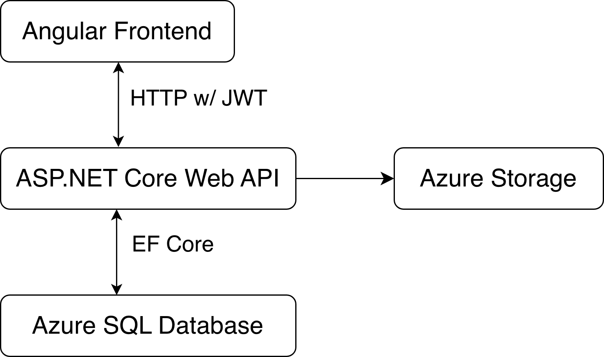
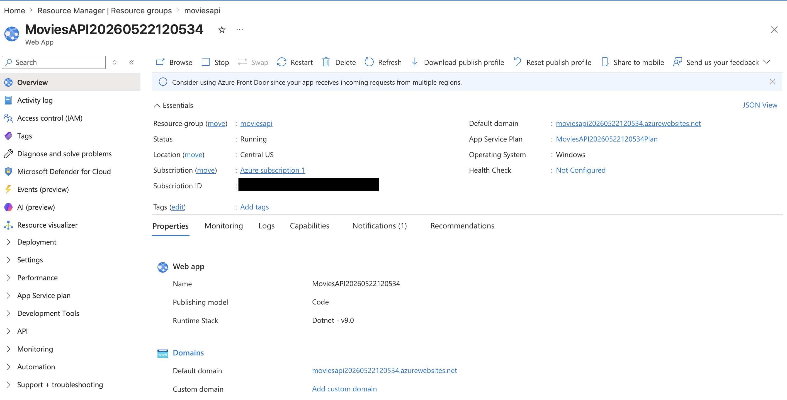
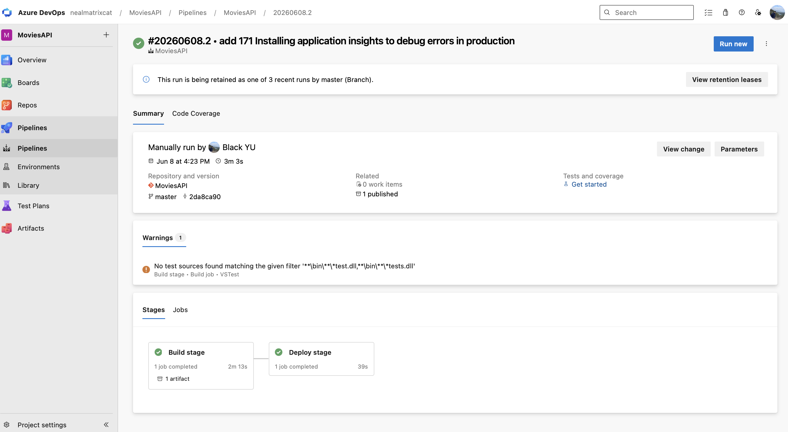
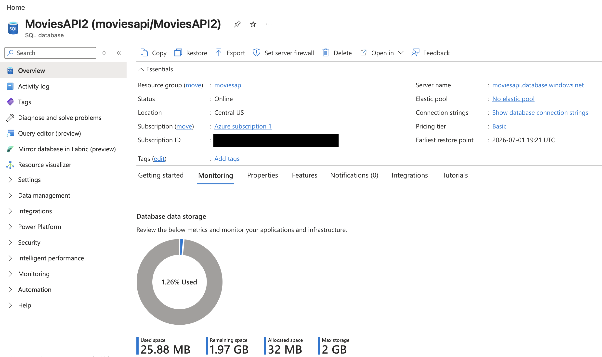
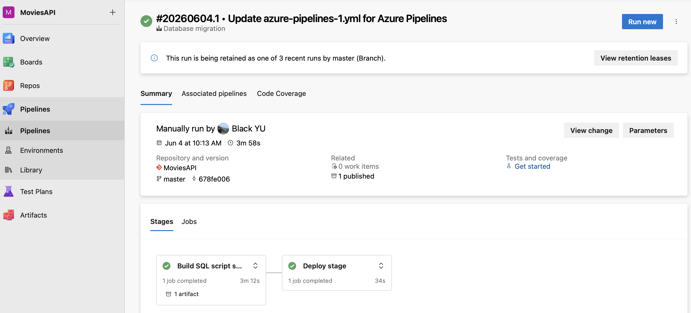

# Movies Full-Stack Web Application
### Description
- Movies Full-Stack Web Application is a portfolio project designed to demonstrate end-to-end full-stack development with an Angular frontend, an ASP.NET Core backend, SQL Server data persistence, JWT-based authentication, role-based authorization, Firebase hosting, Azure cloud deployment with CI/CD pipelines.

- The application allows all the users to browse movie-related information, registered users to rate the movie and admin users to manage genres, actors, theaters, and movies data.

- URL: https://angularmovies20260609113-c0808.web.app

- **Note**: The backend and database are hosted on low-cost cloud resources (Free F1 tier and Basic DTUs) for portfolio purposes. The first request may take **10–15 seconds** due to **cold start** and database wake-up time. Subsequent requests are significantly faster.

### Architecture
- Diagram

    

### Deployment and Azure services
- Frontend: Firebase Hosting 

    

- Backend: Azure App Service (Free F1 tier) 

    

- Backend build and deploy: Azure DevOps pipelines

    

- Image Storage: Azure Storage 

    

- Database: Azure SQL Database  (Basic DTUs)

    

- Database migration: Azure DevOps pipelines

    

- Monitoring: Application Insights 

    

### App Functions
- Vote??

### API Examples